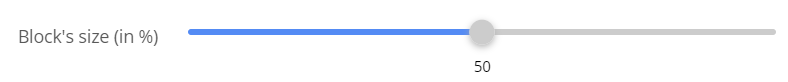

# sevengroupfrance/sulu-range-bundle

Inspired by [this pull request](https://github.com/sulu/sulu-demo/pull/66).

## What is this bundle's goal?
Importing a custom fonctionality into [sulu](https://github.com/sulu/sulu), in this example, a custom content type.
This bundle will import a range input. The range input used is from [react-range](https://www.npmjs.com/package/react-range).



## Installation
1. Go to your `assets/admin` folder and install the react-switch npm package `npm i react-range`.
2. Download the [package](https://packagist.org/packages/sevengroupfrance/sulu-range-bundle) in your project with the following command line:\
`composer require sevengroupfrance/sulu-range-bundle`.
3. In `config/bundles.php` add the following code:\
`SevenGroupFrance\SuluRangeBundle\SuluRangeBundle::class => ['all' => true]`.

4. In `assets/admin/package.json`, add the following line in the "dependencies" object:\
`"sulu-range-bundle": "file:node_modules/@sulu/vendor/sevengroupfrance/sulu-range-bundle/src/Resources/js"`.

5. In `assets/admin`, `npm install` to initialize the bundle's symlink directory.
6. In `assets/admin/index.js`, add this line:\
`import 'sulu-range-bundle'`.

7. In `assets/admin`, `npm run watch` or `npm run build`


## Use in your template files
Once installed, to use this new content type, you'll have to create a new property with the type `sulu_range`.
```
<property name="size" type="sulu_range">
  <meta>
    <title lang="en">Block size</title>
  </meta>
</property>
```

## Setting the step, min and max values
Starting v1.0.1, you can configure your own basic values.
To do so you will have to set several `parameters` in your sulu xml file template.
```
<property name="size" type="sulu_range">
  <meta>
    <title lang="en">Block size</title>
  </meta>
  <params>
    <param name="min" value="20" />
  </params>
</property>
```
The following parameters are available:\
`min`(number): sets the minimum value (same as min attribute in html range input)\
`max`(number): sets the maximum value (same as max attribute in html range input)\
`step`(number): sets the step value (same as step attribute in html range input)\
`ratio`(bool): sets how the output is rendered

If set to true, the `ratio` parameter will display the output like a ratio like this:


For further settings, please refer to the react-range github's [readme](https://github.com/tajo/react-range)
